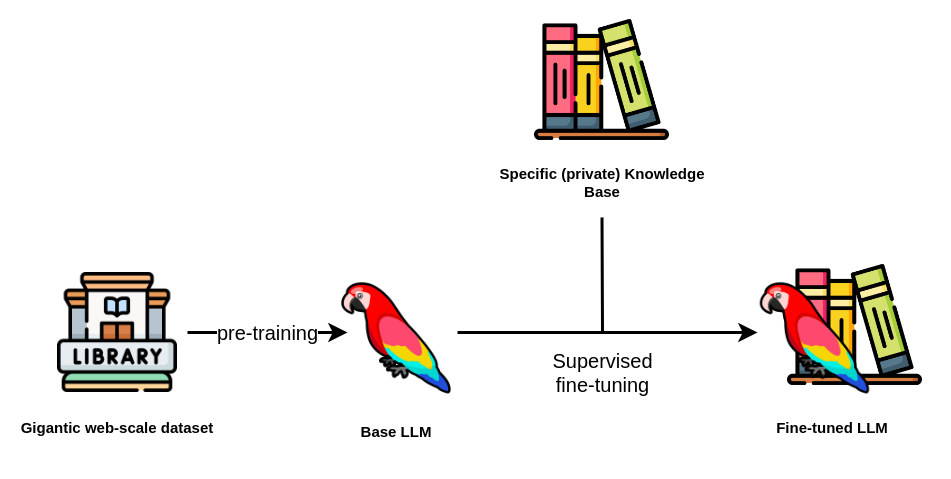

# MyLLM: Fine-Tuning

The `MyLLM/fine-tuning` directory provides resources and scripts for fine-tuning language models on custom datasets, allowing you to adapt pre-trained models for specific tasks. This enables the enhancement of model performance on domain-specific text or tasks such as spam detection and instruction-following.

<p align="center">
    
</p>

## Directory Structure

```
MyLLM/
└── fine-tuning/
    ├── GPT2_124M_SPAM/
    │   ├── eval.py                # Evaluates the fine-tuned model
    │   ├── finetune.py            # Trains the model with custom dataset
    │   ├── model.py               # Defines the language model architecture
    │   ├── data.py                # Custom dataset class for loading and preprocessing
    │   ├── utility.py             # Additional utility functions for processing data
    │
    ├── GPT2_335M_IF/
    │   ├── eval.py                # Evaluates the fine-tuned model
    │   ├── finetune.py            # Trains the model with custom dataset
    │   ├── model.py               # Defines the language model architecture
    │   ├── data.py                # Custom dataset class for loading and preprocessing
    │   ├── utils.py               # Utility functions for model configuration
    │   └── finetune.utils.py      # Additional utility functions for training
    │
    └── README.md                  # Overview of fine-tuning projects
```

## Fine-Tuning Projects

### 1. Fine-Tuning GPT-2 124M for Spam Detection

The **GPT2_124M_SPAM** project is focused on fine-tuning the smaller GPT-2 model (124M parameters) for spam detection. The model is trained to classify text as spam or not, improving its performance through custom training.

#### Scripts Overview

- **`eval.py`**: Evaluates the fine-tuned model on a test dataset.
- **`finetune.py`**: Manages the training process, including loading data and handling the training loop.
- **`model.py`**: Defines the architecture of the GPT-2 model used for fine-tuning.
- **`data.py`**: Contains the custom dataset class for loading and preprocessing the training and validation data.
- **`utility.py`**: Provides additional functions for processing data.

#### Usage:

1. **Prepare Your Dataset**: Make sure your dataset is in an appropriate format (e.g., CSV, JSON). Modify `data.py` if necessary.

2. **Fine-Tune the Model**:
   To start the training process, run the following command:
   ```bash
   python finetune.py --train_data path/to/spam_train_data --val_data path/to/spam_val_data --model_path path/to/save_spam_model --num_epochs 10 --batch_size 32
   ```

3. **Evaluate the Model**:
   After training, evaluate the model using:
   ```bash
   python eval.py --model_path path/to/saved_spam_model --test_data path/to/spam_test_data --batch_size 32
   ```

4. **Interactive Classification**: Once the model is evaluated, you can test it interactively by entering text for classification directly in the terminal.

---

### 2. Fine-Tuning GPT-2 335M for Instruction Following

The **GPT2_335M_IF** project extends the GPT-2 model (335M parameters) for instruction-following tasks. This fine-tuned model understands and generates responses based on user instructions, making it more adaptable to various use cases.

#### Scripts Overview

- **`eval.py`**: Evaluates the performance of the fine-tuned model on a test dataset.
- **`finetune.py`**: Manages the training process, including data loaders and training loops.
- **`model.py`**: Defines the architecture of the language model used for fine-tuning.
- **`data.py`**: Contains the custom dataset class for training and validation data.
- **`utils.py`**: Utility functions for model configuration.
- **`finetune.utils.py`**: Additional utility functions for training.

#### Usage:

1. **Prepare Your Dataset**: Ensure your instruction-following dataset is properly formatted (e.g., CSV, JSON). Adjust `data.py` if needed.

2. **Fine-Tune the Model**:
   Start the training by running:
   ```bash
   python finetune.py --train_data path/to/instruction_train_data --val_data path/to/instruction_val_data --model_path path/to/save_instruction_model --num_epochs 10 --batch_size 32
   ```

3. **Evaluate the Model**:
   After training, use the following command to evaluate the model:
   ```bash
   python eval.py --model_path path/to/saved_instruction_model --test_data path/to/instruction_test_data --batch_size 32
   ```

4. **Interactive Classification**: Test the model interactively by entering instructions directly in the terminal.

---

### 3. Fine-Tuning GPT-2 XL with Alpaca Dataset

The **GPT_XL_ALPACA** project focuses on fine-tuning the GPT-2 XL model with the **Alpaca** dataset, which is designed for instruction-following tasks. This dataset includes over 50,000 examples and leverages techniques such as **LoRA** (Low-Rank Adaptation) and **QLoRA** (Quantized LoRA) for more efficient fine-tuning of large models.everything coded from scratch using just Python and PyTorch.  

#### Directory Structure

```
GPT_XL_ALPACA/
├── model.py             # Defines the base GPT-2 XL architecture
├── data.py              # Prepares the Alpaca dataset for instruction-following
├── qlora_model.py       # Integrates QLoRA into the model
├── utils.py             # Utility functions for model management
├── qlora.py             # Training loop for QLoRA-based fine-tuning
├── eval.py              # Evaluates the model using OLAMA framework
└── README.md            # Project instructions and overview
```

#### Project Components

1. **`model.py`** - Defines the GPT-2 XL model used for fine-tuning.
2. **`data.py`** - Loads and preprocesses the Alpaca dataset for instruction-following tasks.
3. **`qlora_model.py`** - Implements **QLoRA** (Quantized Low-Rank Adaptation) for efficient fine-tuning.
4. **`utils.py`** - Provides utility functions for model initialization and weight merging.
5. **`qlora.py`** - The training loop for fine-tuning the model using QLoRA.
6. **`eval.py`** - Evaluates the fine-tuned model using the OLAMA framework.

#### Fine-Tuning Workflow

The workflow involves preparing the dataset, running the fine-tuning process, and evaluating the model:

1. **Prepare the Dataset**: Ensure your **Alpaca dataset** is in the correct format. Adjust the `data.py` script if needed.
   
2. **Fine-Tune the Model**: Fine-tune the model using **QLoRA**:
   ```bash
   python qlora.py --train_data path/to/alpaca_train_data --val_data path/to/alpaca_val_data --model_path path/to/save_qlora_model --num_epochs 10 --batch_size 16 --learning_rate 1e-5
   ```

3. **Evaluate the Model**: After training, evaluate the model:
   ```bash
   python eval.py --model_path path/to/saved_qlora_model --test_data path/to/alpaca_test_data --batch_size 16
   ```

4. **Interactive Evaluation**: Test the model interactively by providing specific instructions in the terminal.

---

### Advanced Fine-Tuning with QLoRA

- **LoRA** (Low-Rank Adaptation) introduces low-rank matrix factorization for more efficient fine-tuning of large models.
- **QLoRA** extends LoRA with quantization, reducing memory usage and speeding up the training process, enabling fine-tuning in resource-constrained environments.

## Conclusion

The **MyLLM** fine-tuning projects provide comprehensive frameworks for adapting GPT-2 models to specific tasks like spam detection and instruction following. By incorporating techniques like QLoRA and LoRA, these projects enable efficient fine-tuning, even for large models, while improving performance on domain-specific datasets.