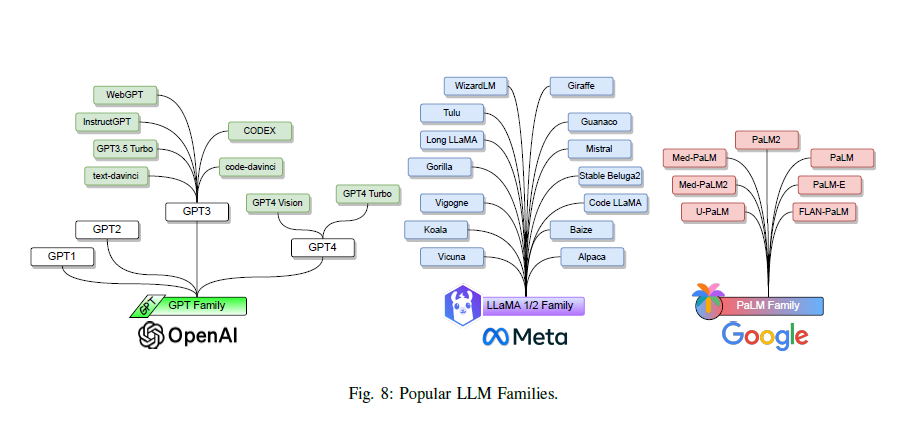

# MyLLM Models

    

Welcome to the **MyLLM/models** repository! This project contains various language models, including implementations of state-of-the-art architectures and optimized techniques to run them efficiently on local machines.

## Models

### 1. **GPT-2** (All Variants)
We have implemented all the variants of GPT-2, ranging from smaller models to larger ones. These models are capable of generating coherent and contextually aware text based on the input.

### 2. **Llama 2 - 7B**
The Llama 2 7B model is designed to provide high performance with a balance between accuracy and efficiency. It has been optimized to run with minimal resources, allowing you to perform inference tasks even on machines with limited hardware.

### 3. **Llama 3.2 (1B & 3B)**
The latest additions to the project are Llama 3.2 (1B and 3B) models. These models have been trained with cutting-edge techniques, ensuring improved performance for a wide range of natural language processing (NLP) tasks.

## Key Features
- **Memory Efficient Techniques**: Leveraging advanced methods, these models can be run on machines with only CPU resources. Through optimizations, we have minimized memory usage, making the models more accessible without requiring a GPU.
  
- **Local Machine Optimization**: Applying these techniques on local machines with no GPU required further tweaking and optimization, enabling a lightweight deployment of the models.

### 4. **Future Plans**
We are actively working on expanding this project to include a variety of models and enhance its diversity:

- **BERT**: Plans to add BERT-based models for improved performance on tasks like classification and question answering.

