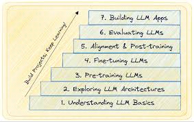

# MyLLM: Notebooks

The `MyLLM/notebooks` directory provides a structured, step-by-step roadmap for building this repository from data collection and preprocessing to fine-tuning. Each notebook guides you through the process of developing large language models (LLMs) from scratch, utilizing first principles to ensure a deep understanding of the underlying methods.

## Purpose

This collection of Jupyter notebooks serves as both a tutorial and a practical guide for users interested in the complete lifecycle of LLM development. It covers essential topics, including data preparation, model architecture, training, and evaluation, enabling users to adapt pre-trained models to their specific tasks.

<p align="center">
    
</p>

### Current Progress

As of now, we are at **Notebook 6.2: Fine-Tuning for Instruction Following**. This notebook focuses on adapting a pre-trained model to better understand and respond to user instructions, enhancing its interactive capabilities.

### Directory Structure

```
MyLLM/
└── notebooks/
    ├── 1.DATA.ipynb                      # Data collection and preprocessing techniques
    ├── 2.ATTENTION.ipynb                  # Understanding attention mechanisms in LLMs
    ├── 3.GPT.ipynb                        # Overview of the GPT architecture
    ├── 4.INFERENCE.ipynb                  # Techniques for model inference and evaluation
    ├── 5.1.TRAIN.ipynb                    # Training methodologies for language models
    ├── 5.2.TRAIN_Pro.ipynb                # Advanced training techniques and strategies
    ├── 6.1.FINE_TUNE_Text_Classification.ipynb  # Fine-tuning for text classification tasks
    ├── 6.2.FINETUNE_Instruction_Following.ipynb  # Fine-tuning for instruction following tasks
    └── README.md                           # This file
```

### Notebook Descriptions

- **1. DATA.ipynb**: This notebook focuses on data collection and preprocessing techniques. It covers various methods for gathering and cleaning datasets, ensuring that the data is well-prepared for training the models.

- **2. ATTENTION.ipynb**: Here, you will learn about the attention mechanisms that power modern LLMs. The notebook explains how attention works and its significance in enhancing model performance, providing visualizations to aid comprehension.

- **3. GPT.ipynb**: This notebook provides an overview of the GPT architecture, detailing its design principles, training strategies, and the innovations that have contributed to its success in natural language processing tasks.

- **4. INFERENCE.ipynb**: Techniques for model inference and evaluation are covered in this notebook. It discusses how to deploy models for practical use and evaluate their performance effectively, including metrics and benchmarks.

- **5.1 TRAIN.ipynb**: In this section, you will find methodologies for training language models. The notebook discusses different training paradigms and their applications, providing code snippets to illustrate implementation.

- **5.2 TRAIN_Pro.ipynb**: Building upon the previous notebook, this one delves into advanced training techniques and strategies that optimize the training process, focusing on aspects such as hyperparameter tuning and model architecture adjustments.

- **6.1 FINE_TUNE_Text_Classification.ipynb**: This notebook explores fine-tuning strategies specifically for text classification tasks. It provides practical examples and guides readers through the necessary steps to adapt pre-trained models to this specific use case.

- **6.2 FINETUNE_Instruction_Following.ipynb**: Currently in progress, this notebook focuses on fine-tuning for instruction-following tasks, aiming to enhance model interaction by training it to better understand and respond to user inputs.

### Upcoming Notebooks

Future notebooks will continue to build on this foundation, covering:

- **Notebook 6.3: Fine-Tuning GPT-2 XL with the Alpaca Dataset Utilizing LoRA and QLoRA Techniques**: A deep dive into advanced techniques for efficient fine-tuning of large models, utilizing the largest variant of GPT-2 and the Alpaca dataset (over 50,000 examples) for comprehensive instruction following.

## Conclusion

This notebook section is designed to provide a comprehensive foundation for anyone interested in LLMs, ensuring you have the knowledge and tools necessary to adapt and innovate. As we progress, additional notebooks will explore advanced techniques and applications, further enhancing our understanding of modern NLP practices.
